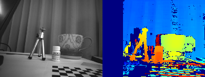

# **stereo-vision-python**

# **基于 Python 和 OpenCV 的双目立体视觉项目**

这是一个端到端的双目立体视觉项目，它实现了从相机标定、立体匹配到三维重建的完整流程。项目代码采用模块化设计，并提供了一个简单易用的命令行界面来执行不同的任务。



## **目录**

* [✨ 主要功能](#-主要功能)  
* [📂 项目结构](#-项目结构)  
* [🚀 快速开始](#-快速开始)  
  * [1\. 环境准备](#1-环境准备)  
  * [2\. 安装依赖](#2-安装依赖)  
* [📖 使用指南](#-使用指南)  
  * [1\. 摄像头标定 (calibrate)](#1-摄像头标定-calibrate)  
  * [2\. 运行主程序 (run)](#2-运行主程序-run)  
  * [3\. 查看帮助](#3-查看帮助)  
* [🔧 参数配置](#-参数配置)

## **✨ 主要功能**

* **相机标定**:  
  * 采用高鲁棒性的**两步标定法**，先进行单目标定，再求解双目相对位姿。  
  * 自动检测棋盘格角点，并进行亚像素级优化。  
  * 生成并保存包含内外参、旋转/平移矩阵和畸变系数的 stereo\_params.yml 文件。  
* **立体匹配**:  
  * 使用经典的 **SGBM (Semi-Global Block Matching)** 算法计算视差图。  
  * 所有SGBM算法的超参数均在 config.py 中可配置。  
* **三维重建**:  
  * 利用视差图和重投影矩阵 Q 将二维图像信息重建为三维点云。  
  * 对生成的点云进行过滤和降采样以获得更干净的结果。  
  * 支持将点云数据保存为 .ply 文件，可在其他3D软件（如 MeshLab）中使用。  
* **交互式可视化**:  
  * 提供了两种最终成果的可视化方式：  
    1. **3D点云显示**：使用 Open3D 库进行交互式三维点云可视化（可选安装）。  
    2. **交互式深度图**：实时显示伪彩色的深度图，当鼠标悬停在图像上时，可以显示该像素点的真实世界距离（毫米）。  
  * 提供“详细模式” (--verbose)，可以显示校正图像对、原始视差图等所有中间调试步骤。  
* **专业的工程实践**:  
  * **模块化设计**: 将不同功能（标定、处理、工具、可视化）解耦到独立的模块中。  
  * **命令行界面**: 基于 argparse 构建，支持 calibrate 和 run 等不同子命令，并提供详细的帮助信息。  
  * **自动化测试**: 包含 pytest 单元测试和稳定性测试，确保代码质量和算法的健壮性。  
  * **依赖管理**: 使用 requirements.txt 文件管理核心依赖，并支持可选依赖（open3d）。

## **📂 项目结构**

stereo-vision-project/  
├── main.py                 \# 主程序入口，命令行界面  
├── config.py               \# 所有配置参数  
├── requirements.txt        \# 项目核心依赖  
|  
├── calibration/            \# 相机标定模块  
│   └── calibrator.py  
├── processing/             \# 核心处理模块  
│   ├── stereo\_matcher.py   \# 立体匹配  
│   └── reconstructor.py    \# 三维重建  
├── utils/                  \# 通用工具函数  
│   ├── file\_utils.py       \# 文件读写  
│   ├── image\_utils.py      \# 图像处理  
│   └── sorting\_utils.py    \# 自然排序  
├── visualization/          \# 可视化模块  
│   └── visualizer.py  
├── tests/                  \# 测试代码  
│   ├── test\_calibration.py  
│   └── test\_calibration\_stability.py  
└── data/                   \# 数据  
    ├── calibration\_images/ \# 用于标定的棋盘格图片  
    └── test\_images/        \# 用于立体匹配的测试图片

## **🚀 快速开始**

### **1\. 环境准备**

首先，克隆本项目到你的本地：

`git clone https://github.com/present-cjn/stereo-vision-python.git`  
`cd stereo-vision-project`

推荐使用 Python 虚拟环境。

\# 创建虚拟环境  
`python \-m venv venv`

\# 激活虚拟环境(macOS/Linux)  
`source venv/bin/activate`

### **2\. 安装依赖**

本项目的核心功能依赖于 requirements.txt。

`pip install \-r requirements.txt`

#### **可选功能：3D可视化**

如果你想使用 3D 点云可视化功能 (--view-3d 标志)，你需要额外安装 Open3D 库。

`pip install open3d`

## **📖 使用指南**

本项目通过 main.py 提供了一个命令行界面。所有命令都应在项目根目录下运行。

### **1\. 摄像头标定 (calibrate)**

这是运行所有功能的第一步。你需要准备好一组双目相机拍摄的棋盘格图片，并放置在 data/calibration\_images/ 目录下（左右图像分别以 leftPic\*.jpg 和 rightPic\*.jpg 命名）。

calibrate 命令通过命令行参数来接收你的标定板信息：

`python main.py calibrate \--corners \<宽边角点数\>,\<高边角点数\> \--size \<格子边长mm\>`

示例:  
对于一个内角点为 11x8，格子边长为 12mm 的标定板，命令如下：  
`python main.py calibrate \--corners 11,8 \--size 12

为了方便在IDE中调试，你也可以不提供任何参数，此时程序会自动使用在 config.py 文件中定义的默认值。

如果你想查看标定过程中的角点检测效果，可以随时添加 \-v 或 \--verbose 全局标志：

`python main.py \-v calibrate \--corners 11,8 \--size 12`

### **2\. 运行主程序 (run)**

当标定完成后，你可以运行主程序来进行立体匹配和三维重建。你需要准备一对测试图片，并将其路径在 config.py 中配置好。

* **默认行为 (显示交互式深度图)**:  
  `python main.py run`

  程序会弹出一个窗口，左侧为原始图像，右侧为彩色深度图。在右侧窗口移动鼠标，左上角会实时显示该点的距离。  
* **额外显示三维点云 (需要已安装 open3d)**:  
  `python main.py run \--view-3d`

  在显示交互式深度图的同时，会额外弹出一个可交互的 3D 窗口来显示重建的点云。程序总会生成 .ply 点云文件，无论是否使用此标志。  
* **开启详细调试模式**:  
  使用 \-v 或 \--verbose 标志，可以显示所有的中间过程图像（如校正图、原始视差图）。  
  `python main.py \-v run \--view-3d`

### **3\. 查看帮助**

随时可以通过 \--help 查看所有命令和选项的详细说明。

```shell
python main.py \--help  
python main.py calibrate \--help  
python main.py run \--help
```

## **🔧 参数配置**

项目中的所有可调参数都集中在 config.py 文件中，包括：

* 文件和目录路径。  
* 用于快速调试的**默认**棋盘格参数，可在运行时被命令行覆盖。  
* SGBM 算法的所有超参数。  
* 算法的终止条件 criteria。

你可以直接修改此文件来调整算法的行为和效果，而无需改动核心代码。